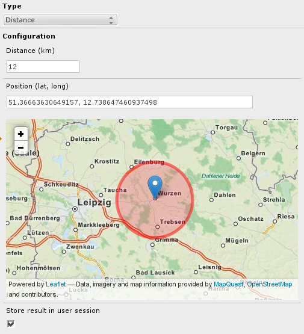

********************
Geolocation contexts
********************
Allows you to show pages and content elements for people in certain
countries, continents or within a given area.

It uses the `Maxmind GeoIP`__ database to determine the user's probable
physical location.
Note that this is working most of the time, but also fails regularly.

Country and Continent rules are pretty safe to use, while small distances
are not accurate at all.

__ http://www.maxmind.com/en/geolocation_landing

=====
Setup
=====
#. Install PHP extension ``geoip``, e.g. via PEAR or Pyrus
#. Install and activate this TYPO3 extension ``contexts_geolocation``

Dependencies
============
- ``contexts`` TYPO3 extension
- ``geoip`` PHP extension, see `its homepage`__

__ http://pecl.php.net/package/geoip

=============
Context types
=============
The ``contexts_geolocation`` extension ships with three different
context types:

Continent
=========
Matches when the user is on one of the selected continents.

Continent ``- unknown -`` can be used to match all users whose position
could not be determined.

Country
=======
Matches when the user accessing the page is in one of the selected countries.

Country ``- unknown -`` can be used to match all users whose position
could not be determined.

Distance
========
Select a location on a map and a distance, and the context matches when
the user's location is within this area.

Note that the free geoip database does seldom give you exact locations,
so this is more a fun experiment rather that it should be used in production.

